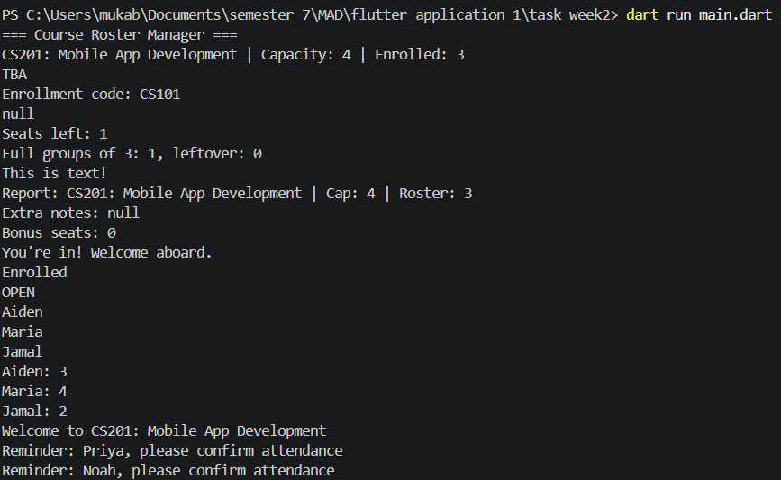
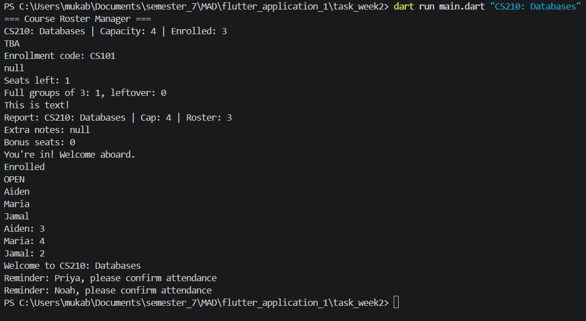

# Lab 1: Dart Fundamentals — Course Roster Console App

**Course:** Session 1 (Dart Syntax, Types & Control Flow)  
**Deliverables:** `main.dart`, `README.md`

---

## Overview

A console application built using pure Dart demonstrating core language fundamentals:
- Correct function structure (`main()` and `printWelcome()`).
- Dart's type system: `var`, `final`, `const`, and explicit types (`String`, `int`, `double`, `bool`, `List`, `Map`, `Set`).
- Sound null safety: `?`, `??`, `??=`, `?.`, and `late`.
- Operators: `~/`, `%`, `is`, `is!`, cascade `..`, and null-safe cascade `?..`.
- Control flow: `if`/`else`, `switch` with `break`, and ternary operator (`? :`).
- Loops & collections: `for-in`, `forEach`, and collection literals with embedded `if` and `for`.
- Stretch Goals: CLI arguments (`args`), code formatting (`dart format`), static analysis (`dart analyze`), and `Set.union()`.

---

## Completed Parts

- [x] **Part 1 — Setup & Welcome:** `printWelcome()` function with `///` doc comment called from `main()`.
- [x] **Part 2 — Course & Roster Data:** Declarations using `const`, `final`, and explicit types. Interpolated summary string.
- [x] **Part 3 — Null-Safe Instructor Info:** Unassigned `String? instructorEmail`, fallback with `??`, `late String enrollmentCode` assigned via `generateCode()`, and safe null-aware access (`?.`).
- [x] **Part 4 — Formatting Strings:** `.split(',')` and `for-in` with `.trim()`, multi-line triple-quoted string (`'''...'''`), and `${}` expression interpolation.
- [x] **Part 5 — Operators in Action:** Truncating division `~/`, modulo `%`, type tests `is`/`is!`, cascade `..`, null-safe cascade `?..`, and null-aware assignment `??=`.
- [x] **Part 6 — Enrollment Logic:** `if`/`else` capacity check, `switch` statement with `break` on all cases, and ternary status tag.
- [x] **Part 7 — Reports & Loops:** Roster output via `for-in`, attendance via `forEach`, and announcements list built using collection-if and collection-for.
- [x] **Part 8 — Stretch Goals:**
  - CLI argument support via `args`: dynamically overrides course title when provided.
  - Formatted with `dart format .`.
  - Preview of Session 2 using `Set.union()`.

---

## How to Run

Run with default course title:
```bash
dart run main.dart
```

Run with custom course title via CLI argument:
```bash
dart run main.dart "CS210: Databases"
```

## Program Output




