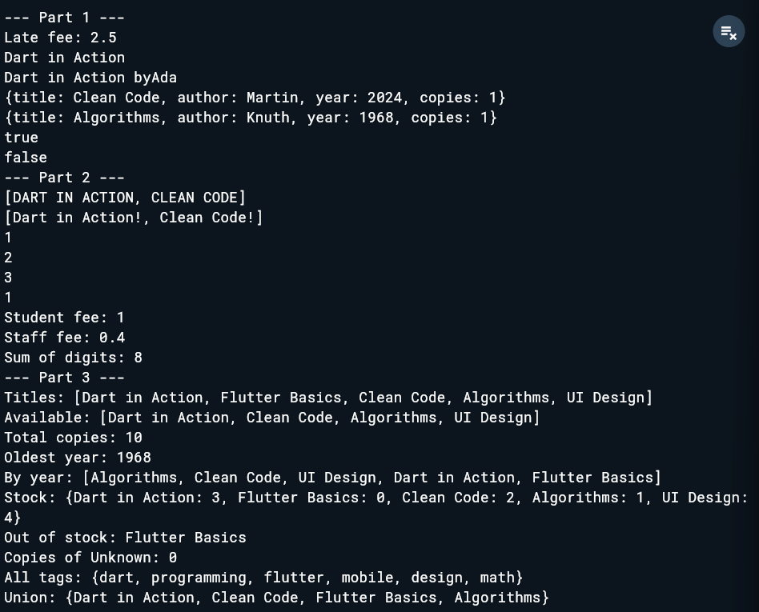
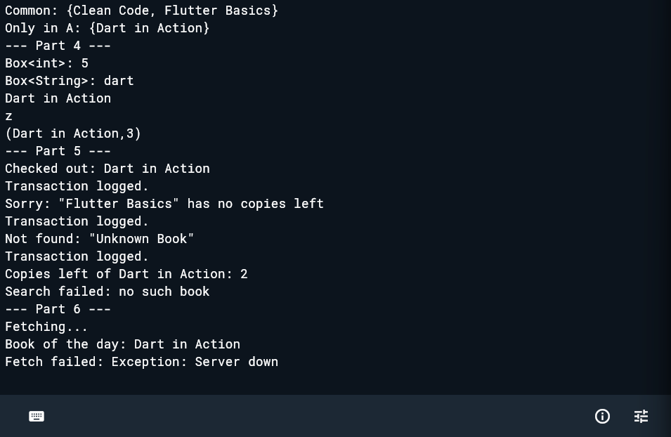

# Week 3 Lab: Library Desk Assistant

**Course:** CS 442 | Mobile Application Development
**Name:** Muhammad Kabeer Khan 
**Roll No:** 04072313029

## Task Overview

This assignment implements the back-end logic for a campus library desk using pure Dart. The project is divided into six logical parts, demonstrating core Dart concepts on a unified dataset of library books:

* **Part 1: Functions & Parameters** 
  Utilizes positional, optional, and named parameters, alongside arrow (`=>`) syntax to calculate fees, format strings, and create book records.
* **Part 2: Closures, Higher-Order Functions & Recursion** 
  Passes functions as arguments (e.g., mapping strings), implements closures that maintain state (like `makeCounter`), and uses recursion for math operations.
* **Part 3: Collections (List, Map & Set)** 
  Uses functional collection methods (`map`, `where`, `fold`, `reduce`) to filter books, compute stock counts, sort lists immutably, and perform set operations (union, intersection, difference) on book tags.
* **Part 4: Generics** 
  Implements type-safe reusable classes (`Box<T>`, `Pair<A, B>`) and generic functions (`firstOr<T>`) to handle varied data types dynamically.
* **Part 5: Error Handling** 
  Defines custom exception classes (`BookNotFoundException`, `BookNotAvailableException`) and uses `try/on/catch/finally` blocks to safely manage inventory checkouts.
* **Part 6: Future & Async/Await** 
  Simulates asynchronous network calls using `Future.delayed` and correctly handles async error states.

---

## Expected Output

When the program is executed, the console output must exactly match the following:
```

--- Part 1 ---

Late fee: 2.5
Dart in Action
Dart in Action by Ada
{title: Clean Code, author: Martin, year: 2024, copies: 1}
{title: Algorithms, author: Knuth, year: 1968, copies: 1}
true
false
--- Part 2 ---
[DART IN ACTION, CLEAN CODE]
[Dart in Action!, Clean Code!]
1
2
3
1
Student fee: 1.0
Staff fee: 0.4
Sum of digits: 8
--- Part 3 ---
Titles: [Dart in Action, Flutter Basics, Clean Code, Algorithms, UI Design]
Available: [Dart in Action, Clean Code, Algorithms, UI Design]
Total copies: 10
Oldest year: 1968
By year: [Algorithms, Clean Code, UI Design, Dart in Action, Flutter Basics]
Stock: {Dart in Action: 3, Flutter Basics: 0, Clean Code: 2, Algorithms: 1, UI Design: 4}
Out of stock: Flutter Basics
Copies of Unknown: 0
All tags: {dart, programming, flutter, mobile, design, math}
Union: {Dart in Action, Clean Code, Flutter Basics, Algorithms}
Common: {Clean Code, Flutter Basics}
Only in A: {Dart in Action}
--- Part 4 ---
Box<int>: 5
Box<String>: dart
Dart in Action
z
(Dart in Action, 3)
--- Part 5 ---
Checked out: Dart in Action
Transaction logged.
Sorry: "Flutter Basics" has no copies left
Transaction logged.
Not found: "Unknown Book"
Transaction logged.
Copies left of Dart in Action: 2
Search failed: no such book
--- Part 6 ---
Fetching...
Book of the day: Dart in Action
Fetch failed: Exception: Server down
```
screenshots are here:



